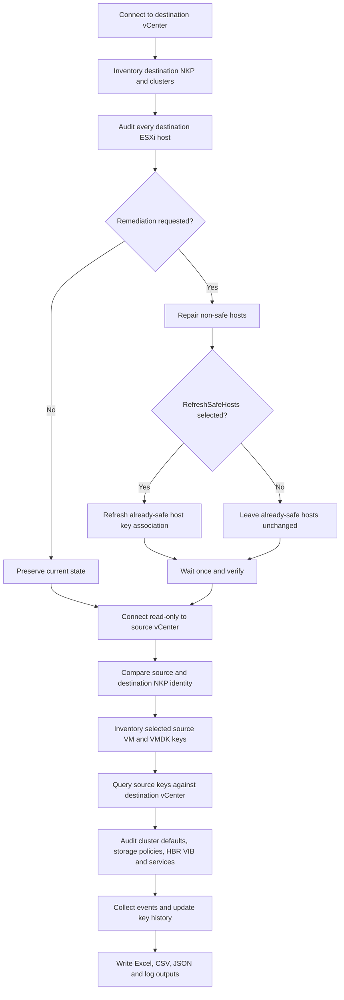

# vSphere NKP and HCX Encrypted-Migration Readiness

`NKPAuditandRepairRevC.ps1` audits and optionally repairs VMware vSphere Native Key Provider readiness across destination clusters, compares source and destination NKP identities, inventories source VM and VMDK keys, queries whether the destination vCenter can resolve those keys, and collects HCX host-readiness evidence.

The tool is intended for errors such as:

- Destination vCenter is not configured with the source encryption provider.
- Destination vCenter or ESXi hosts do not have the requisite key providers.
- An encrypted VM requires an encryption-capable destination storage policy.

> The script reports key identifiers and metadata only. It does not export plaintext cryptographic key material.

## Revision C capabilities

- Audits all destination clusters when `-Cluster` is omitted.
- Compares source and destination NKP name, provider ID, and Native Key ID.
- Filters source inventory to one or more HCX VM names.
- Inventories source VM-home and VMDK key IDs before migration.
- Inventories destination host, VM, VMDK, and vCenter key IDs.
- Runs destination `QueryCryptoKeyStatus()` against discovered source and destination keys.
- Reports whether each source key is available to destination vCenter.
- Audits destination host crypto state and runtime provider.
- Audits cluster crypto-safe host counts and cluster default provider where PowerCLI exposes it.
- Inventories encryption-related SPBM storage policies.
- Checks for HBR-related VIBs, services, firewall rules, and triggered host alarms.
- Optionally repairs non-safe hosts.
- Optionally refreshes the key association on already-safe hosts.
- Creates Excel, CSV, JSON history, and timestamped log artifacts.

## Requirements

- PowerShell 7 or later
- Destination and source vCenter connectivity
- VMware PowerCLI and ImportExcel
- Read permissions on source vCenter
- Cryptographic inventory and host-management permissions on destination vCenter
- PowerShell Gallery access when using `-InstallPrerequisites`, or approved offline modules

## Full diagnostic and remediation run

> **Caution:** This command includes `-Remediate -RefreshSafeHosts`. It can refresh the host encryption-key association on hosts that are already cryptographically safe. Run the `-WhatIf` variation first in a new environment and execute through change control.

```powershell
$destinationCredential = Get-Credential `
    -Message "Destination vCenter credential"

$sourceCredential = Get-Credential `
    -Message "Legacy source vCenter credential"

.\NKPAuditandRepairRevC.ps1 `
    -vCenter "DestinationvCenterFQDN" `
    -Credential $destinationCredential `
    -SourceVCenter "SourcevCenterFQDN" `
    -SourceCredential $sourceCredential `
    -KeyProvider "DEV1" `
    -RefreshSafeHosts `
    -Remediate `
    -HCXVMName "RICTWATYTS101V" `
    -EncryptionStoragePolicyName "VM Encryption Policy" `
    -IncludeHCXReadiness `
    -RecentKeyDays 30 `
    -EventLookbackDays 7 `
    -EventMaxSamples 5000 `
    -InstallPrerequisites
```

Because `-Cluster` is omitted, this run includes every cluster returned by the destination vCenter.

## Safer WhatIf run

```powershell
$destinationCredential = Get-Credential `
    -Message "Destination vCenter credential"

$sourceCredential = Get-Credential `
    -Message "Legacy source vCenter credential"

.\NKPAuditandRepairRevC.ps1 `
    -vCenter "DestinationvCenterFQDN" `
    -Credential $destinationCredential `
    -SourceVCenter "SourcevCenterFQDN" `
    -SourceCredential $sourceCredential `
    -KeyProvider "DEV1" `
    -RefreshSafeHosts `
    -Remediate `
    -HCXVMName "RICTWATYTS101V" `
    -EncryptionStoragePolicyName "VM Encryption Policy" `
    -IncludeHCXReadiness `
    -RecentKeyDays 30 `
    -EventLookbackDays 7 `
    -EventMaxSamples 5000 `
    -InstallPrerequisites `
    -WhatIf
```

## Read-only HCX diagnostic run

```powershell
.\NKPAuditandRepairRevC.ps1 `
    -vCenter "DestinationvCenterFQDN" `
    -SourceVCenter "SourcevCenterFQDN" `
    -KeyProvider "DEV1" `
    -HCXVMName "RICTWATYTS101V" `
    -EncryptionStoragePolicyName "VM Encryption Policy" `
    -IncludeHCXReadiness `
    -EventLookbackDays 7 `
    -InstallPrerequisites
```

## Workflow



## Key command variations

### Limit the run to selected destination clusters

```powershell
.\NKPAuditandRepairRevC.ps1 `
    -vCenter "DestinationvCenterFQDN" `
    -Cluster "Management-Cluster","Compute-Cluster-01" `
    -SourceVCenter "SourcevCenterFQDN" `
    -KeyProvider "DEV1" `
    -IncludeHCXReadiness
```

### Compare multiple source VMs

```powershell
.\NKPAuditandRepairRevC.ps1 `
    -vCenter "DestinationvCenterFQDN" `
    -SourceVCenter "SourcevCenterFQDN" `
    -KeyProvider "DEV1" `
    -HCXVMName "VM01","VM02","VM03" `
    -IncludeHCXReadiness
```

### Repair only non-safe destination hosts

```powershell
.\NKPAuditandRepairRevC.ps1 `
    -vCenter "DestinationvCenterFQDN" `
    -KeyProvider "DEV1" `
    -Remediate `
    -PropagationSeconds 300
```

### Refresh already-safe hosts only when explicitly required

```powershell
.\NKPAuditandRepairRevC.ps1 `
    -vCenter "DestinationvCenterFQDN" `
    -KeyProvider "DEV1" `
    -Remediate `
    -RefreshSafeHosts `
    -PropagationSeconds 300 `
    -IncludeHCXReadiness
```

### Fast current-state run without events

```powershell
.\NKPAuditandRepairRevC.ps1 `
    -vCenter "DestinationvCenterFQDN" `
    -SourceVCenter "SourcevCenterFQDN" `
    -KeyProvider "DEV1" `
    -HCXVMName "RICTWATYTS101V" `
    -IncludeHCXReadiness `
    -SkipEventHistory
```

### Custom output and persistent history paths

```powershell
.\NKPAuditandRepairRevC.ps1 `
    -vCenter "DestinationvCenterFQDN" `
    -SourceVCenter "SourcevCenterFQDN" `
    -KeyProvider "DEV1" `
    -OutputPath "C:\NKPReports\HCX-Readiness.xlsx" `
    -LogPath "C:\NKPReports\HCX-Readiness.log" `
    -KeyHistoryPath "C:\NKPReports\History\Destination-NKP-History.json"
```

## Workbook worksheets

- **Summary**: Scope, remediation totals, source comparison, key-status totals, and errors.
- **Providers**: Current destination NKP properties.
- **Host Status**: Initial and final host crypto state, provider, remediation, and verification.
- **Key Usage**: Destination host, VM, VMDK, and vCenter key mappings.
- **All Keys**: Consolidated destination key inventory with date confidence and usage.
- **Provider Events**: Historical destination provider events.
- **Source Providers**: Source-to-destination provider identity comparison.
- **Source Key Usage**: Source VM-home and VMDK key identifiers.
- **vCenter Key Status**: Destination availability and usage status for source and destination keys.
- **HCX Readiness**: Per-host crypto, HBR VIB, service, firewall, alarm, and readiness evidence.
- **Cluster Readiness**: Crypto-safe host counts and cluster default-provider evidence.
- **Storage Policies**: Candidate and requested encryption storage policies.
- **Errors**: Collection, query, remediation, verification, and reporting errors.

## Interpretation order for the HCX validation error

1. **Source Providers**: Provider name and Native Key ID should match the restored destination provider.
2. **Source Key Usage**: The failing source VM should show VM-home and encrypted VMDK key IDs.
3. **vCenter Key Status**: Source keys should show `KeyAvailableToTargetVCenter=True` and `DestinationReadiness=Available`.
4. **Cluster Readiness**: All eligible destination hosts should be crypto safe.
5. **Host Status**: Runtime provider should match the selected NKP.
6. **Storage Policies**: The requested encryption storage policy should exist and be selected in HCX.
7. **HCX Readiness**: HBR VIB and services should be present and running; review firewall evidence and alarms.
8. Validate end-to-end TCP 32032, HCX service mesh, secure listener, and HCX inventory outside the report.

## Safety notes

- `-RefreshSafeHosts` does not import missing VM keys and does not fix a mismatched NKP identity.
- The script does not restart `hostd`, `vpxa`, HBR, or HCX services automatically.
- A service restart does not fix a missing source key, provider mismatch, absent storage policy, or blocked network path.
- Preserve the NKP backup and password through approved recovery controls.
- Preserve the JSON history file between runs.
- Sanitize workbooks, logs, key IDs, VM names, and datastore paths before publishing examples.
