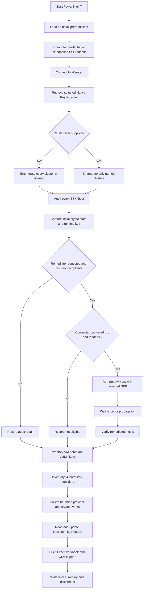

# vSphere Native Key Provider Audit and Repair

`NKPAuditandRepairRevA.ps1` audits VMware vSphere Native Key Provider configuration across a vCenter Server, optionally repairs eligible ESXi hosts, inventories cryptographic key identifiers, correlates keys to hosts, virtual machines, and virtual disks, and produces Excel, CSV, JSON, and log artifacts.

The script is designed for operational validation after creating, importing, restoring, or changing a vSphere Native Key Provider.

> **Security note:** The script reports key identifiers and provider identifiers. It does not read or export plaintext cryptographic key material.

## Key capabilities

- Discovers Native Key Providers from the selected vCenter Server.
- Audits every cluster when `-Cluster` is omitted.
- Supports one or more named clusters when `-Cluster` is supplied.
- Evaluates every ESXi host against the selected NKP.
- Records initial and final host crypto state.
- Optionally assigns the NKP with `Set-VMHost -KeyProvider`.
- Processes eligible hosts without prompting for every host by default.
- Waits once for propagation, then verifies remediated hosts.
- Maps key identifiers to:
  - ESXi host runtime and coredump encryption
  - VM home and configuration encryption
  - Virtual disk encryption
  - vCenter CryptoManager inventory
- Retains first-seen and last-seen key history in JSON.
- Uses bounded vCenter event collection by default.
- Separates historical provider events from current provider state.
- Excludes backup, warning, alarm, health, status, certificate, and connection events from key-assignment date inference.
- Creates a blue-themed Excel workbook and matching CSV exports.
- Writes a timestamped execution log from the beginning of the run.

## Repository contents

| File | Purpose |
|---|---|
| `NKPAuditandRepairRevA.ps1` | Main audit, remediation, inventory, and reporting script. |
| `README.md` | Quick start, common commands, outputs, and safety guidance. |
| `Wiki-Home.md` | Detailed operational guide, architecture, parameters, interpretation, and troubleshooting. |
| `LICENSE` | Project license, if included in the repository. |

## Requirements

- PowerShell 7 is recommended for the documented workflow.
- Network access from the execution host to vCenter Server.
- A vCenter account with permissions sufficient to:
  - Read clusters, hosts, VMs, events, and key-provider configuration
  - Read cryptographic inventory
  - Manage host cryptographic configuration when `-Remediate` is used
- PowerShell modules:
  - `VMware.VimAutomation.Core`
  - `VMware.VimAutomation.Storage`
  - `ImportExcel`
- PowerShell Gallery access when using `-InstallPrerequisites`, or approved offline installation of the required modules.

Microsoft Excel is not required. The `ImportExcel` module creates the workbook directly.

## Workflow



## Recommended command

The recommended all-cluster audit and repair command is:

```powershell
.\NKPAuditandRepairRevA.ps1 `
    -vCenter "pod01vcsa01.corp.achieve-1.com" `
    -KeyProvider "DEV1" `
    -Remediate `
    -PropagationSeconds 60 `
    -RecentKeyDays 30 `
    -EventLookbackDays 7 `
    -InstallPrerequisites
```

Because `-Cluster` is omitted, the script audits every cluster returned by the connected vCenter Server. Eligible noncompliant hosts are remediated with `DEV1`.

## Safer first run

Preview remediation without changing hosts:

```powershell
.\NKPAuditandRepairRevA.ps1 `
    -vCenter "pod01vcsa01.corp.achieve-1.com" `
    -KeyProvider "DEV1" `
    -Remediate `
    -PropagationSeconds 60 `
    -RecentKeyDays 30 `
    -EventLookbackDays 7 `
    -WhatIf `
    -InstallPrerequisites
```

## Common command variations

### Audit only, all clusters

```powershell
.\NKPAuditandRepairRevA.ps1 `
    -vCenter "vcenter.example.com" `
    -KeyProvider "Production-NKP" `
    -RecentKeyDays 30 `
    -EventLookbackDays 7 `
    -InstallPrerequisites
```

### Audit and repair all clusters

```powershell
.\NKPAuditandRepairRevA.ps1 `
    -vCenter "vcenter.example.com" `
    -KeyProvider "Production-NKP" `
    -Remediate `
    -PropagationSeconds 300 `
    -RecentKeyDays 30 `
    -EventLookbackDays 30 `
    -InstallPrerequisites
```

### Audit one cluster

```powershell
.\NKPAuditandRepairRevA.ps1 `
    -vCenter "vcenter.example.com" `
    -Cluster "Management-Cluster" `
    -KeyProvider "Production-NKP"
```

### Audit selected clusters

```powershell
.\NKPAuditandRepairRevA.ps1 `
    -vCenter "vcenter.example.com" `
    -Cluster "Management-Cluster","Compute-Cluster-01","Compute-Cluster-02" `
    -KeyProvider "Production-NKP"
```

### Use a stored credential object

```powershell
$credential = Get-Credential

.\NKPAuditandRepairRevA.ps1 `
    -vCenter "vcenter.example.com" `
    -Credential $credential `
    -KeyProvider "Production-NKP"
```

### Ignore an untrusted vCenter certificate for the current PowerCLI session

```powershell
.\NKPAuditandRepairRevA.ps1 `
    -vCenter "vcenter.example.com" `
    -KeyProvider "Production-NKP" `
    -IgnoreInvalidCertificate
```

Use this only when the certificate condition is understood and accepted by organizational policy.

### Custom output, log, and persistent history paths

```powershell
.\NKPAuditandRepairRevA.ps1 `
    -vCenter "vcenter.example.com" `
    -KeyProvider "Production-NKP" `
    -OutputPath "C:\NKPReports\Production-NKP-Audit.xlsx" `
    -LogPath "C:\NKPReports\Production-NKP-Audit.log" `
    -KeyHistoryPath "C:\NKPReports\History\Production-NKP-History.json"
```

### Fast current-state audit without vCenter event history

```powershell
.\NKPAuditandRepairRevA.ps1 `
    -vCenter "vcenter.example.com" `
    -KeyProvider "Production-NKP" `
    -SkipEventHistory
```

The workbook still contains current host, VM, VMDK, and key mappings. Assignment-date confidence will normally be `ObservationOnly` unless retained history provides an earlier first-seen date.

### Increase bounded event retrieval

```powershell
.\NKPAuditandRepairRevA.ps1 `
    -vCenter "vcenter.example.com" `
    -KeyProvider "Production-NKP" `
    -EventLookbackDays 90 `
    -EventMaxSamples 20000
```

### Full retained event-range scan

```powershell
.\NKPAuditandRepairRevA.ps1 `
    -vCenter "vcenter.example.com" `
    -KeyProvider "Production-NKP" `
    -EventLookbackDays 180 `
    -DeepEventScan
```

`-DeepEventScan` can take a long time on a busy vCenter. The bounded default is preferred for routine use.

### Explicit interactive confirmation

```powershell
.\NKPAuditandRepairRevA.ps1 `
    -vCenter "vcenter.example.com" `
    -KeyProvider "Production-NKP" `
    -Remediate `
    -Confirm
```

Normal use does not require confirmation for every host. `-Confirm` deliberately enables interactive confirmation.

## Outputs

The script writes artifacts beneath the current directory unless custom paths are provided:

```text
NKP-Audit-vcenter.example.com-yyyyMMdd-HHmmss.xlsx
NKP-Audit-vcenter.example.com-yyyyMMdd-HHmmss.log
NKP-Key-History-vcenter.example.com.json
NKP-Audit-vcenter.example.com-yyyyMMdd-HHmmss-CSV\
├── Summary.csv
├── Providers.csv
├── Host_Status.csv
├── Key_Usage.csv
├── All_Keys.csv
├── Provider_Events.csv
└── Errors.csv
```

### Workbook worksheets

- **Summary**: Run scope, counts, retrieval mode, history path, and overall compliance.
- **Providers**: Current provider identity and properties exposed by PowerCLI.
- **Host Status**: Initial and final host state, runtime key provider, remediation, and verification.
- **Key Usage**: One row per discovered host, VM, VMDK, or vCenter key use.
- **All Keys**: One row per unique provider/key pair with assignment evidence, confidence, age, usage counts, objects, hosts, and VMs.
- **Provider Events**: Historical provider-related events, including backup history, separated from current state.
- **Errors**: Collection, remediation, verification, history, and report errors.

## Interpreting results

A host is considered compliant when the host is connected, powered on, in `CryptoState=safe`, and readable through the host CryptoManager.

Important status values include:

- `AlreadyHealthy`: No change was required.
- `FixedByScript`: The host was initially noncompliant, remediation succeeded, and verification passed.
- `NotEligible`: The host was disconnected, powered off, or could not be read safely.
- `CommandFailed`: `Set-VMHost` returned an error.
- `CouldNotVerify`: Remediation ran, but verification could not be completed.
- `StillBroken`: Remediation completed but final compliance checks did not pass.

Assignment-date confidence values:

- `High`: An assignment or rekey event contains the exact key ID.
- `Medium`: An assignment or rekey event matches an exact inventory object name.
- `ObservationOnly`: No trustworthy assignment event was found. The timestamp is a first-seen observation, not an authoritative assignment date.

## Important operational notes

- Preserve the JSON history file between runs. `FirstSeenUtc` is meaningful only when the same history file is retained.
- Historical `not backed up` events do not override the current provider state.
- A provider backup file must still be retained securely outside the report output.
- Inventory mappings can identify keys even when vCenter `ListKeys()` does not return the same key.
- `-Remediate` can change host cryptographic configuration. Use `-WhatIf` before first use in a new environment.
- If `-Cluster` is omitted, every cluster in the connected vCenter is included.

## Troubleshooting

### No output appears after credential entry

Use the current script with bounded event collection. Watch the timestamped log in another PowerShell window:

```powershell
Get-Content .\NKP-Audit-*.log -Wait
```

For a faster diagnostic run, add `-SkipEventHistory`.

### Workbook is locked

Close Excel and any preview application holding the destination file, then rerun or specify a different `-OutputPath`.

### Required module is missing

Run with `-InstallPrerequisites`, or install approved versions manually:

```powershell
Install-Module VMware.PowerCLI -Scope CurrentUser
Install-Module ImportExcel -Scope CurrentUser
```

### No matching provider or cluster

Confirm exact inventory names:

```powershell
Connect-VIServer vcenter.example.com
Get-KeyProvider
Get-Cluster
```

### Provider backup state says not exposed

Some installed PowerCLI object versions do not expose a dedicated NKP backup-state property. Validate current state in the vSphere Client. Historical backup events are reported separately and are not treated as current status.

## License and contributions

See `LICENSE` for license terms. Contributions should preserve safe defaults, truthful evidence labeling, persistent-history compatibility, bounded event collection, and separation between current provider state and historical provider events.
